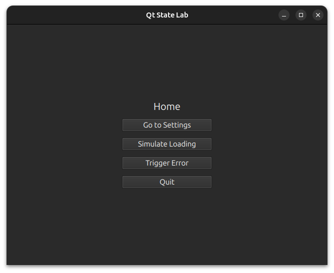

# QtStateLab

QtStateLab is a Qt 6 application demonstrating a clean separation between
QML presentation and C++ application logic using a centralized application
state, enum-driven navigation, and persistent settings.

This project is intended as a reference architecture for Qt/QML applications.

## Screenshot



## Goals

- Keep QML as a pure view layer
- Centralize application state in C++
- Expose state to QML via reactive properties
- Use enum-based navigation instead of magic strings
- Demonstrate async behavior without blocking the UI
- Provide a scalable foundation for networking, models, and workers

## Architecture Overview

```bash
C++ (Application Layer)
├── AppState
│   ├── Global UI state (loading, errors)
│   ├── Enum-based screen navigation
│   └── Async operations using QTimer
│
└── SettingsManager
    └── Persistent user preferences (QSettings)

QML (View Layer)
├── Screens (Home, Settings)
├── Global Overlays (Loading, Error)
└── Reusable Components (Buttons, Controls)
```

## Key Concepts Demonstrated

- `QObject` + `Q_PROPERTY` for reactive state
- `Q_ENUM` exposed to QML
- QML singletons via `qmlRegisterSingletonInstance`
- Enum-driven navigation using `StackView`
- Async UI updates with `QTimer`
- Persistent settings via `QSettings`

## Navigation

Navigation is controlled by the `AppState::Screen` enum in C++:

```cpp
enum class Screen {
    Home,
    Settings
};
